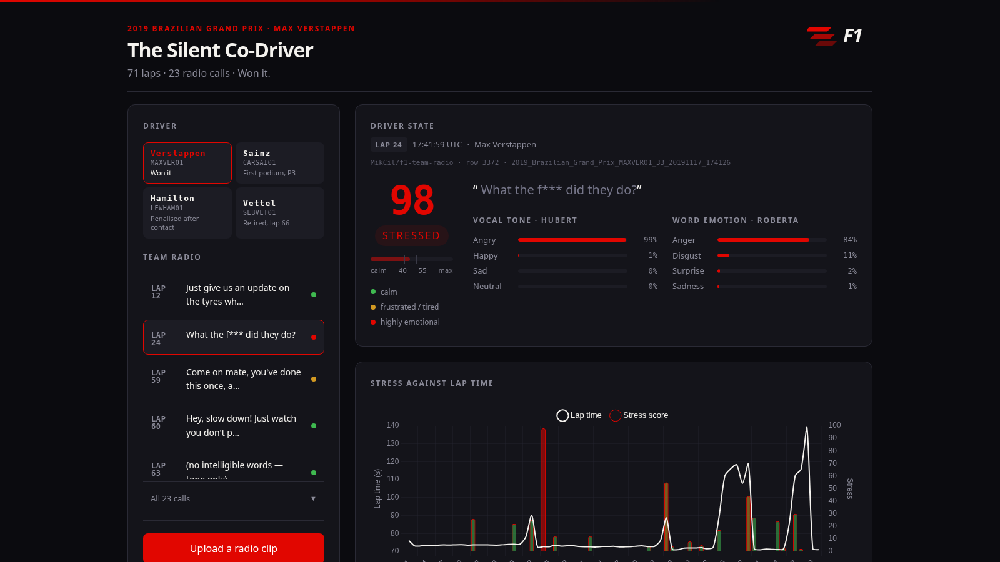

# The Silent Co-Driver

Reads driver stress from Formula 1 team radio, and lines it up against the real
lap times nobody connects it to.

**[Presentation (Google Slides)](https://docs.google.com/presentation/d/18KpD-N1qZz-IirTM5YQVlFXKfGk4JwXepVmh9bDD5ng/edit?usp=sharing)** — the 10-slide walkthrough: the problem, how it works, and why the lap join checks itself.



A pit wall tracks tyre temperature, fuel and sector deltas — dozens of streams,
all numeric. The one channel nobody processes in real time is the driver's own
voice. This listens to it, scores how stressed he sounds from 0–100, and drops
that score onto the lap chart next to his actual lap time.

**Demo data: 2019 Brazilian Grand Prix, four drivers** — Verstappen (won),
Sainz (first podium), Hamilton (penalised after contact), Vettel (retired on lap
66). 278 real laps, 72 real radio calls, every call joined to its lap on a
timestamp.

---

## Run it

Needs Python 3.12 and about 6 GB of disk for the models.

```bash
git clone https://github.com/yabhinav1/silent-co-driver.git
cd silent-co-driver

# uv is the easiest way to get a 3.12 environment
curl -LsSf https://astral.sh/uv/install.sh | sh
uv venv --python 3.12
uv pip install -r requirements.txt

.venv/bin/python app.py
```

Then open **http://127.0.0.1:8000**.

**First run downloads ~6 GB of models** from the Hugging Face Hub and takes a
while. Every run after that loads from the local cache in about 16 seconds and
**never touches the network** — `app.py` sets `HF_HUB_OFFLINE=1` once it sees a
populated cache, because a cached model still makes a HEAD request per file and
that stalls for minutes on bad wifi.

All 72 clips are pre-analysed in `results.json`, so clicking them is instant.
Only uploading a new file runs the models (~8 s on 8 cores).

## How it works

| Step | Model | Job |
|---|---|---|
| 1 | `Systran/faster-whisper-large-v3` | audio → transcript + a timestamp per word |
| 2 | `superb/hubert-large-superb-er` | audio → emotion from the **sound** |
| 3 | `j-hartmann/emotion-english-distilroberta-base` | text → emotion from the **words** |
| 4 | *(ours)* | blend into one 0–100 score, join to the lap |

The blend is the only real logic here — about 20 lines in `stress_score()`:

- **Tone outweighs words, 0.65 / 0.35.** A driver saying "I'm fine" through
  gritted teeth is not fine.
- **There are two ways to not be okay.** Stress is loud, fatigue is flat. Vocal
  energy separates them, so a quiet, flat delivery reads TIRED, not CALM.
- **Thresholds are measured, not chosen** — the 90th percentile of each axis
  across 63 real radio clips. Team radio is far flatter than ordinary speech, so
  a threshold that "feels right" labels nothing.

### The join checks itself

Radio timestamps come from a Hugging Face dataset. Lap times come from the F1
timing feed via `fastf1`. Two unrelated sources, joined only on a timestamp —
and they agree:

| Radio call | Lands on | Lap time |
|---|---|---|
| *"… **outlap** critical. Yeah man, I realise"* | lap 44 | **89.0 s** (+15.6) — a real out-lap |
| *"**Safety car** needs to speed up, man"* | lap 57 | **120.6 s** (+47.2) |
| *"Verstappen 14-0… **don't miss this shot**"* | lap 21 | **88.8 s** (+15.4) — his first stop |

Nobody aligned those by hand.

## Layout

```
app.py          backend: models, scoring, API           ~270 lines
index.html      whole frontend, no framework, no build  ~660 lines
laps.csv        driver, lap, lap time, tyre, position    278 rows
radio.csv       driver, lap, clip, UTC, dataset row id    72 rows
results.json    pre-analysed clips, so the demo is instant
clips/          the audio
test_score.py   self-check on the scoring logic
```

Three endpoints: `GET /api/laps`, `POST /api/analyse`, `GET /`.

## Check it

```bash
.venv/bin/python test_score.py
```

Asserts angry outscores calm by 40+, gritted-teeth still reads stressed,
quiet-and-flat reads tired, a silent clip never reads as fatigue, and scores
stay in 0–100.

## Things that broke, and why they're worth knowing

- **Whisper silently dropped whole speakers.** Without voice-activity detection
  it kept the engineer's reply and threw away the driver's question — on a
  project about the driver's voice. Caught because the loudest part of a
  waveform had no words against it. `vad_filter=True` fixed it.
- **Every message was on the wrong lap.** Lap boundaries were first derived by
  assuming the race started at 17:10:00 UTC. Lights-out was 17:13:00, so all 34
  calls sat 2–3 laps early — and the chart still looked plausible. Using the
  real `LapStartDate` from telemetry fixed it.
- **Whisper drifted out of English** on short, noisy radio, returning confident
  Dutch, Thai and Welsh. `language="en"` is pinned.
- **Never warm models on a background thread.** `functools.cache` is not atomic;
  two threads building the same pipeline produced a model missing its output
  layer, which transcribed pure noise and reported no error.

## Swapping in another race

Nothing in `app.py` is specific to this Grand Prix. Regenerate `laps.csv` and
`radio.csv` for any race the dataset covers and list the drivers in `DRIVERS` at
the top of `app.py`.

## Team

- **Abhinav Yadav**
- **Divesh Arora**

## Links

- **[Presentation (Google Slides)](https://docs.google.com/presentation/d/18KpD-N1qZz-IirTM5YQVlFXKfGk4JwXepVmh9bDD5ng/edit?usp=sharing)**
- **[Dataset: MikCil/f1-team-radio](https://huggingface.co/datasets/MikCil/f1-team-radio)**

## Credits

Built for AI Race Month · GrandPrix. Data and model attribution, and the
trademark disclaimer, are in [ATTRIBUTION.md](ATTRIBUTION.md).
